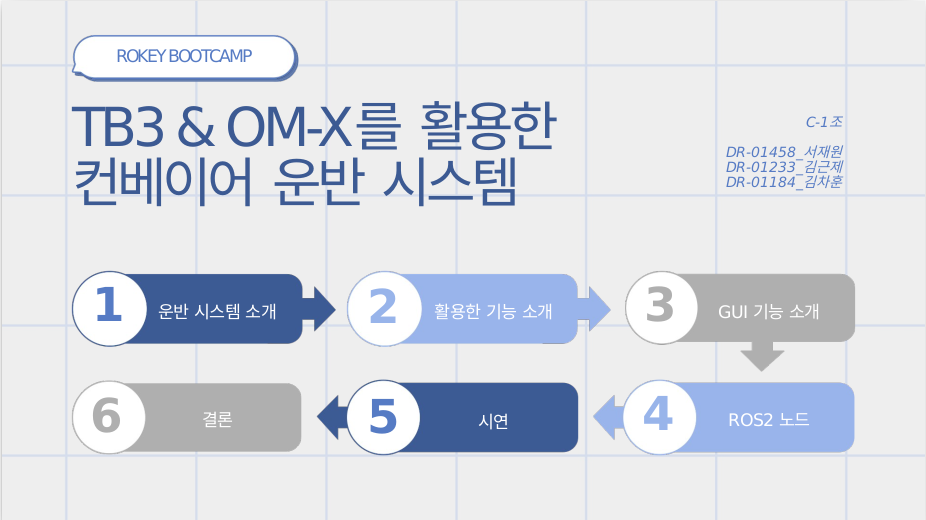
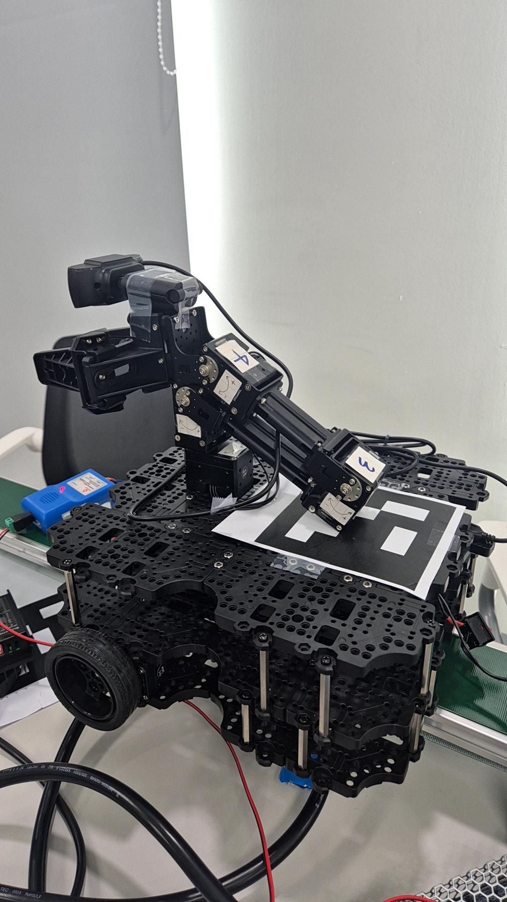
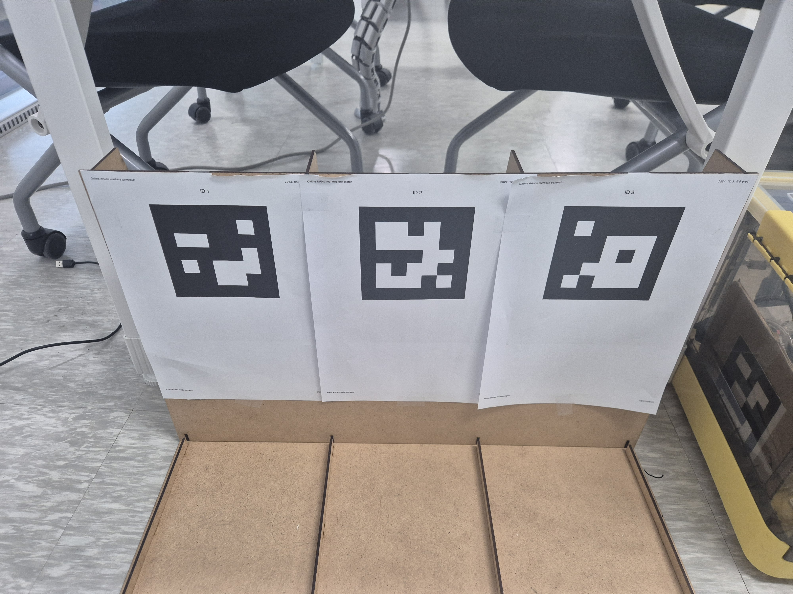
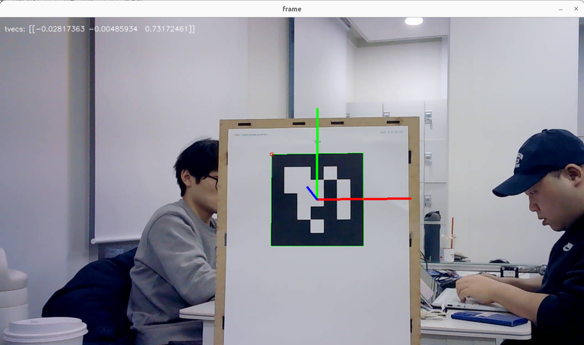
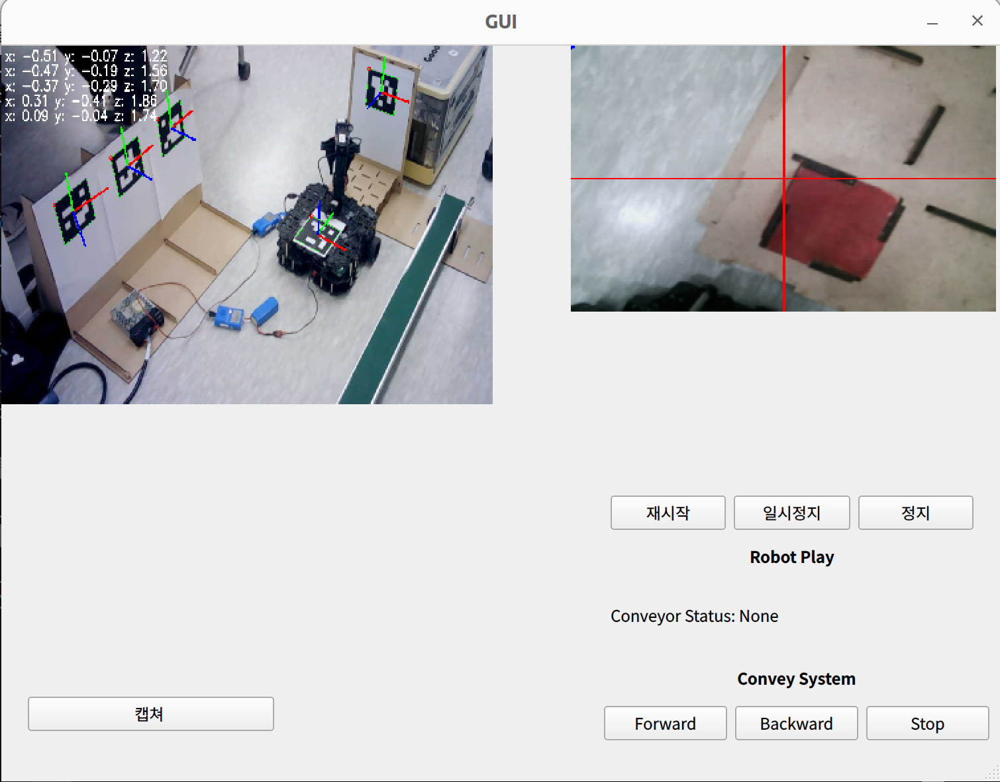
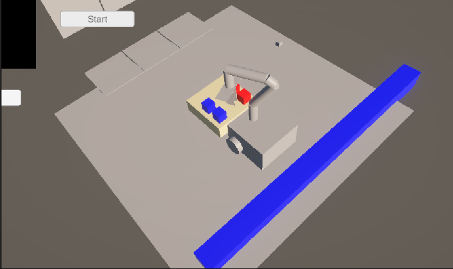
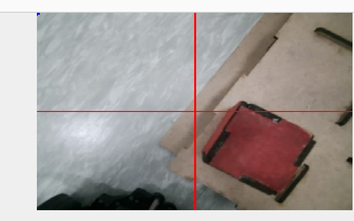

# 🚚 7주차: TB3 & OM-X를 활용한 컨베이어 운반 시스템

본 프로젝트는 **TurtleBot3(TB3)와 OpenManipulator-X(OM-X)를 활용하여 컨베이어 기반의 물품 운반 시스템을 구현하는 것**을 목표로 합니다.

## 📜 발표 자료  

## 📌 프로젝트 개요
- **프로젝트명**: TB3 & OM-X를 활용한 컨베이어 운반 시스템
- **발표일**: 2024.12.16
- **팀명**: C-1조
- **팀원**: 서재원, 김근제, 김차훈

## 🎯 프로젝트 목표
- **ROS2를 활용한 자동화 운반 시스템 구축**
- **TurtleBot3와 OpenManipulator-X를 활용한 물품 이송**
- **ArUco 및 YOLOv8을 이용한 물품 탐색 및 인식**

## ⚙️ 시스템 개요
### ✅ 주요 기능
- **컨베이어 벨트를 이용한 자동화 물품 이송**
- **TurtleBot3가 목표 지점으로 이동하여 물품 운반**
- **OpenManipulator-X를 활용한 파렛트 적재**
- **YOLOv8 기반 물체 탐지 및 ArUco 마커를 통한 정밀 위치 보정**

### 🖼 실습 환경
<table>
  <tr>
    <td align="center">
      
    </td>
    <td align="center">
      
    </td>
  </tr>
</table>

### 📊 사용한 ROS2 기능
| No. | 기능명 | 설명 |
|----|---------|--------------------------------------------------|
| 1  | `move_base` | TB3의 자율 주행 |
| 2  | `aruco_marker_detect` | ArUco 마커를 이용한 정밀 위치 인식 |
| 3  | `yolo_object_detect` | YOLOv8을 활용한 물체 탐지 |
| 4  | `openmanipulator_pick` | OM-X를 이용한 물체 집기 |
| 5  | `openmanipulator_place` | OM-X를 활용한 물체 놓기 |
| 6  | `conveyor_control` | 컨베이어 벨트 속도 및 방향 제어 |
| 7  | `goal_publisher` | 물품 운반 목적지 설정 |
| 8  | `camera_stream` | 실시간 카메라 스트리밍 |
| 9  | `display_dashboard` | GUI에서 로봇 상태 및 경로 표시 |

## 🏗️ 운반 계획
1. **컨베이어 벨트에서 물품 픽업 위치로 이동** (TurtleBot3)
2. **ArUco 마커를 활용하여 물체 위치 보정**
3. **OpenManipulator-X를 활용하여 물체 집기**
4. **TurtleBot3가 목표 지점으로 물체 운반**
5. **OM-X를 활용하여 물체 내려놓기 및 운반 완료**

## 🔥 프로젝트 결과
### 📌 주요 코드 리뷰
#### 🏗️ ArUco 마커 기반 정밀 위치 보정
- **aruco_marker_detect()를 활용하여 물체 위치 보정**
- **로봇의 오차를 줄이고 정확한 집기 작업 수행**

#### 🏗️ YOLOv11n을 활용한 물체 탐지
- **yolo_object_detect()를 활용하여 컨베이어 위의 물체 탐색**
- **탐지된 물체를 좌표 변환하여 로봇이 접근 가능하도록 설정**

#### 🏗️ 컨베이어 벨트 제어
- **conveyor_control()을 이용하여 벨트 속도 및 방향 제어**
- **TurtleBot3와 OM-X가 동기화하여 픽업 동작 수행**

#### 🏗️ 자율 주행을 통한 물품 운반
- **move_base()를 활용하여 TurtleBot3가 최적 경로로 이동**
- **목표 지점으로 정확하게 도착하여 물품 하역**

### 🏆 실습 결과물
<table>
  <tr>
    <td align="center">
      
       <b>Pose estimation using AcUco Marker</b> 
    </td>
  </tr>
  <tr>
    <td align="center">
      
       <b>System</b> 
    </td>
  </tr>
  <tr>
    <td align="center">
      
       <b>Simulation using Unity</b> 
    </td>
  </tr>
  <tr> 
    <td align="center">
      
       <b>Error in Centering</b> 
    </td>
  </tr>  
</table>