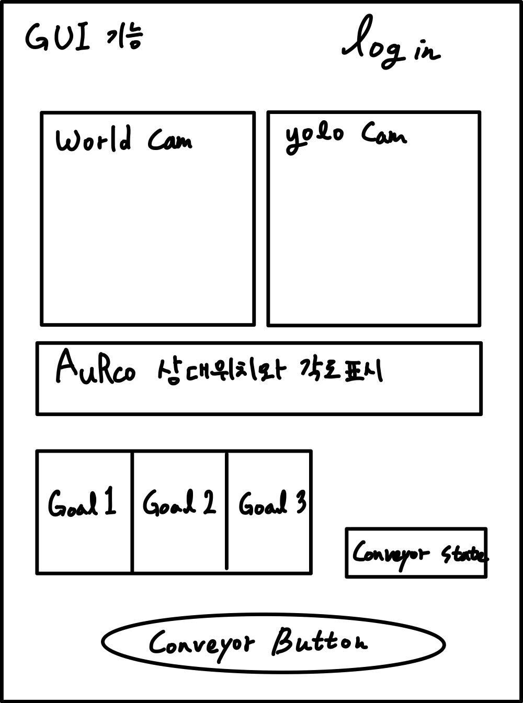

# rokey_week5_ws
7주차 프로젝트 


## 강사님 github 
https://github.com/karlkwon/spark_x_F



## 각자 배정된 브랜치 이름 
재원: jaewon 
차훈: chahoon
근제: geunje

#### 자기의 branch로 바꾸기
```
git checkout ~~~
```
#### commit 하고 올리는 방법 
```
git add .
```

```
git commit -m "메모"
```
```
git push origin $브랜치 이름 
```
#### main에서 pull하는 방법 

```
git pull origin main
```

#### main에서 merge하여 종합하기 

```
git checkout main 
```
```
git merge branch1
git merge branch2
git merge branch3
```

#### git에서 log 확인하여 복구 
```
git checkout main ( 브랜치)
```

```
git reset --hard origin main
```

```
git log --oneline

```

그리고 해당 번호 찾아서 

```
git checkout ~~~
```


#### 각자 branch에서 main을 가져다가 사용하기 

1. 자기 자신의 branch로 변경 
```
git checkout <branch-name>

```

2. 만약에 충돌 발생시 강제로 가져오기 
```
git fetch origin main
git reset --hard origin/main
```

#### 항상 branch의 default를 자신의 브랜치로 변경 
```
git branch --set-upstream-to=origin/<branch-name>
```